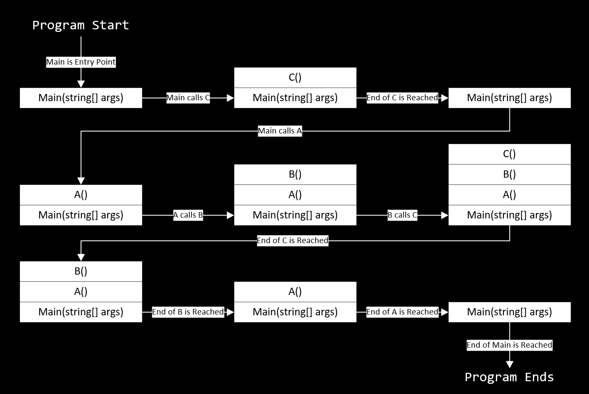
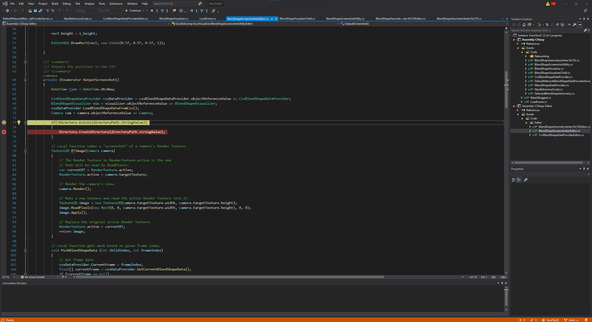
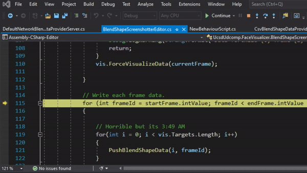
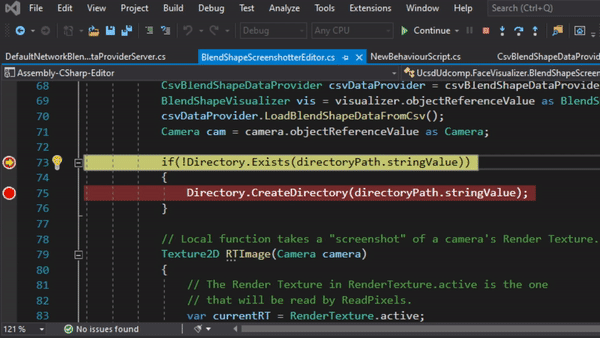
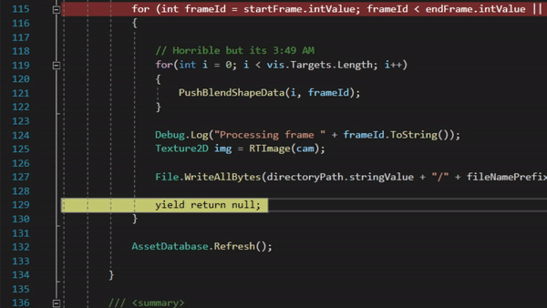

# Debugging 102

> "There has never been an unexpectedly short debugging period in the history of computers."
>
> <cite>Steven Levy</cite>

Now that we understand the fundamentals of debugging, we will now learn how to leverage modern debugging tools to assist in our debugging process.

AP Computer Science A and other courses emphasized debugging through the use of print statements and. While this builds good habits early, debugging with just print statements is not very efficient. This article will enlighten you to the glorious power of the modern debugger, and it will certainly become a crutch you will learn on for the long-term future! Muhahahaha!


## Methods and the Runtime Stack

Before we learn about the debugger, let's first talk about how functions actually execute in a program.

When code runs, the processor has an internal data structure called the 'Runtime Stack' that is used to keep track of the processor's current position within the program and provide a space to store local variables. 

You can imagine the runtime stack works like a literal stack of labelled notecards. Every time the processor calls a new method, it adds a 'notecard' to the top of the stack. On this 'notecard' is the current method and all of its local variables. When the processor reaches the end of the currently executing method, it removes the topmost notecard from the stack. 

Consider the following code:

```csharp
public class StackDemo
{
    // This function is where the program starts.
    public static void Main(string[] args)
    {
        C();
        A();
    }

    public void A()
    {
        // Do stuff
        B();
    }

    public void B()
    {
        // Do stuff
        C();
    }

    public void C()
    {
        // Do stuff;
    }
}
```

If we were watching the runtime stack as the program executed, it would look something like the following diagram:



The following diagram visualizes what the stack looks like at after each method call:

In technical terms, each one of these notecards is called a **stack frame.** The idea is that the stack frame on the very top of the stack will always have the currently executing function, and each stack frame under it represents the function that called the function above it. The bottom of the stack will have the function that represents the entry-point of the application.[^1]


## Stack Traces

When a program throws an unhandled exception or error, the program will crash. One of the things a program does when it crashes is that it writes the current stack trace to an error log. A **stack trace** is the list of all of the stack frames on the runtime stack. You can think of it as the precise location of where the program crashed, including the precise function where the error occured and all the functions called to reach that point.

A typical stack trace from an error log looks something like this:

```
```

Stack traces are invaluable to debugging because they help narrow down the logical path the program took to reach the error. With a stack trace, you can see exactly what path the code took to reach the place where it crashed. This helps narrow down the possibilities of the cause of the bug.

## Using the Debugger in Unity

This section will focus on teaching how to use the debugger in code within Unity projects. However, it is worth mentioning that almost all debuggers work in the same way, so almost everything you learn from this article should be readily applicable in many other programming languages and environments.

### Programs Required

In order to use the Visual Studio debugging tools, you will need the following tools and applications.

- Unity
- Visual Studio (Not VS Code)
- [Visual Studio Tools for Unity](https://docs.microsoft.com/en-us/visualstudio/gamedev/unity/get-started/visual-studio-tools-for-unity)

In addition, you cannot be connected to a VPN. It's just a weird quirk, don't mention it.

### Attaching the Debugger

In order to use the debugger, you first must 'attach' it to the Unity process. This allows the debugger to follow along with Unity when it is executing your code. Attaching the debugger prevents any edits to the code as long as the debugger is attached.

Look for a button at the top of the Visual Studio IDE that says "Attach to Unity." Click that to attach the debugger.


### Breakpoints

One of the main features of a modern debugger is breakpoints. Breakpoints halt the program execution when reached. You can use the debugger to either continue executing the program at real time or step through the code line-by-line. Breakpoint debugging makes it easy to visualize how your program flows at a particular section, and you can use breakpoint debugging to see if certain parts of your program are being reached during execution.

To make a breakpoint, click on the blank space between the line numbers and the text area:


When the program reaches a breakpoint, the debugger will halt the program. This is what Visual Studio will look like when execution is halted. The yellow line represents the current line where the program execution halted:



When halted, the debugger has the following commands. Here are brief descriptions of each:

#### Continue

Continue resumes the program execution at real time until the program ends or the debugger hits another breakpoint. Visual Studio should minimize to reveal Unity running.



#### Step Into

Step Into moves the debugger to the immediate next line in the code. If that line is a method that will create a new stack frame, the debugger will enter the method and halt at the first line inside the method. One quirk is that the debugger will execute any methods not defined by the user in realtime; for example, `Directory.Exists()` is part of the .NET Framework, so it is executed at realtime before the debugger halts at the next line.



#### Step Over

Step Over moves the debugger to the immediate next line in the code. If that line is a method that will create a new stack frame, the debugger will enter that method and execute the entire function at real time before halting at the very next line after that method.

#### Step Out

Step Out resumes the program execution until the current method is finished executing. In other words, it executes the program until the current stack frame is removed off of the runtime stack.


### Peeking Variables

When the execution is halted by a breakpoint, the debugger actually allows you to peek the value of any value that exists within the current execution context. The current execution context includes anything in the runtime stack and the heap (memory where object data is stored). To peek a value of a variable, field, or property, just hover your mouse cursor over any occurence of that variable, field, or property. No print statements required!



The combination of being able top peek variables while stepping through the program line-by-line opens up a whole new world of debugging possibilities. Being able to walk through the code at your own pace and validate that every field is correct allows you to catch issues faster than trying to walk through the code with a pencil and paper. Overall, it's just a much better experience!

[^1]: In multithreaded contexts, each thread gets its own stack, and the bottom of the stack will have the entry function for that thread. Multithreading is really complex though.
